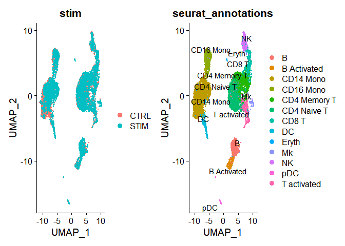
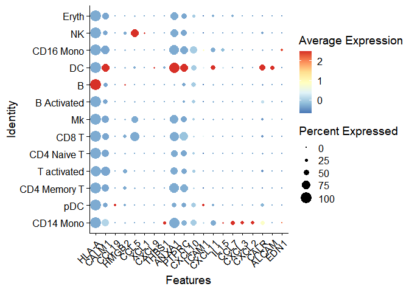
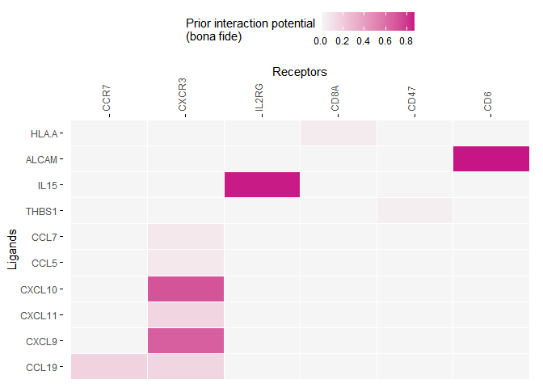
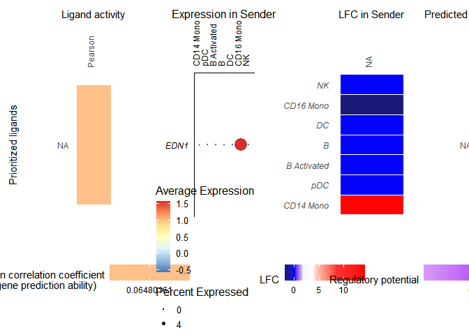

Single Cell Workshop - Cell interaction analysis
================
Asif Javed, Alexandre Mondaini \|
06-07-2021

-   [Data download](#data-download)
-   [Prerequisite](#prerequisite)
-   [Install packages](#install-packages)
-   [Read in the dataset and Create a Seurat
    objects](#read-in-the-dataset-and-create-a-seurat-objects)
-   [Cell interaction analysis](#cell-interaction-analysis)

## Data download

We will use a PBMC dataset made available as part of the `SeuratData`
package. This dataset contains two PBMC samples: Stimulated sample
treated with IFN Beta as well as control samples. Please follow
instructions on `SeuratData` download below. On the first attempt to
access it, the data will be downloaded to your directory. Subsequent
attempts would read it from that folder.

For interaction analysis we will be using NicheNet which requires a few
curated datasets. While these can be downloaded from within R
environment, the download speed was too slow for me. I have instead
downloaded it to my dropbox. The files can be downloaded from the
following links.
[gr\_network.rds](https://www.dropbox.com/s/ajv5ldiv4x3r5uf/gr_network.rds?dl=0)
[ligand\_target\_matrix.rds](https://www.dropbox.com/s/yf2vzjre3i2qvo2/ligand_target_matrix.rds?dl=0)
[lr\_network.rds](https://www.dropbox.com/s/muv638ah3n5f0f4/lr_network.rds?dl=0)
[weighted\_networks.rds](https://www.dropbox.com/s/x1po2sk500ac6aj/weighted_networks.rds?dl=0)

Please copy this dataset to the working directory you intend to use for
the workshop.

## Prerequisite

The workshop content uses `Seurat`
<a href="https://satijalab.org/seurat/articles/integration_introduction.html">data
integration vignettes</a> to generate the input data for interaction
analysis. It assumes you are familiar with the preprocessing components.

## Install packages

Let’s start by installing the necessary packages one by one

``` r
# I needed to install limma separately
if (!requireNamespace("BiocManager", quietly = TRUE))
    install.packages("BiocManager",repos = "http://cran.us.r-project.org")
BiocManager::install("limma")
```

``` r
if (!requireNamespace("BiocManager", quietly = TRUE))
    install.packages("BiocManager",repos = "http://cran.us.r-project.org")
BiocManager::install("glmGamPoi")
```

``` r
# install.packages("devtools")
install.packages("https://seurat.nygenome.org/src/contrib/ifnb.SeuratData_3.0.0.tar.gz", repos = NULL, type = "source") 
```

``` r
devtools::install_github("saeyslab/nichenetr",repos = "http://cran.us.r-project.org")
```

``` r
install.packages("tidyverse",repos = "http://cran.us.r-project.org")
```

``` r
install.packages("dplyr",repos = "http://cran.us.r-project.org")
```

And loading them into R.

``` r
# load into your session
library(ifnb.SeuratData)
library(Seurat)

# load dataset
data("ifnb")
```

## Read in the dataset and Create a Seurat objects

The first step is to read the data from the `SeuratData` package. The
input data is split based on sample and individually `SCtranform` is
applied. Notice this replaces the `NormalizeData`, `ScaleData`, and
`FindVariableFeatures`. SCTransform is a statistical approach
specifically designed for single cell UMI count data. It overcomes some
of the overfitting limitations of prior bulk designed normalization
methods. More details of its advantages can be found in [SCtranform
manuscript](https://genomebiology.biomedcentral.com/articles/10.1186/s13059-019-1874-1).
Notice that we applied no quality control steps. This is because the
data was precleaned obviating the need to repeat these steps.

``` r
ifnb.list <- SplitObject(ifnb, split.by = "stim")
ifnb.list <- lapply(X = ifnb.list, FUN = SCTransform, method = "glmGamPoi")
features <- SelectIntegrationFeatures(object.list = ifnb.list, nfeatures = 3000)
ifnb.list <- PrepSCTIntegration(object.list = ifnb.list, anchor.features = features)
ifnb.list <- lapply(X = ifnb.list, FUN = RunPCA, features = features)
```

Next we integrate the two datasets. The integration relies on highly
variable features which are common to both datasets and is conducted in
two steps. The first step `FindIntegrationAnchors` defines <b>
anchors</b> or cell pairs (one member from each sample) which are highly
similar and hence can be confidently expected to be assigned to the same
cluster (cell type and state). The second step `IntegrateData` uses the
defined anchor pairs to align the complete datasets. More details on the
integration method upgrades since the original Seurat paper can be found
in their [more recent
publication](https://pubmed.ncbi.nlm.nih.gov/34062119/)

``` r
immune.anchors <- FindIntegrationAnchors(object.list = ifnb.list, normalization.method = "SCT",    anchor.features = features, dims = 1:30, reduction = "rpca", k.anchor = 20)
immune.combined.sct <- IntegrateData(anchorset = immune.anchors, normalization.method = "SCT", dims = 1:30)
```

The integrated object contains both the batch effect corrected values as
well as the original count values as separate assays.

``` r
immune.combined.sct <- RunPCA(immune.combined.sct, verbose = FALSE)
immune.combined.sct <- RunUMAP(immune.combined.sct, reduction = "pca", dims = 1:30)
```

``` r
# Visualization
p1 <- DimPlot(immune.combined.sct, reduction = "umap", group.by = "stim")
p2 <- DimPlot(immune.combined.sct, reduction = "umap", group.by = "seurat_annotations", label = TRUE,
    repel = TRUE)
p1 + p2
```

<!-- -->

## Cell interaction analysis

[NicheNet](https://pubmed.ncbi.nlm.nih.gov/31819264/) aims to predicts
ligand and target cell interaction links by combining cluster specific
single cell expression data with prior knowledge of ligand-receptor
pairs and gene regulatory networks downstream of the targets. In
particular it aims to define ligands which best explain the differential
expression observed in target cluster.

We begin by loading the neccessary R packages. :warning: Some of the
`Seurat` integration commands failed to successfully execute after I
loaded the NicheNet package. There might be some incompatabilities
between the two packages.

``` r
library(nichenetr)
library(tidyverse)
```

Next we load the required datasets one-by-one

``` r
ligand_target_matrix = readRDS("ligand_target_matrix.rds")
ligand_target_matrix[1:5,1:5]
```

    ##                 CXCL1        CXCL2        CXCL3        CXCL5         PPBP
    ## A1BG     3.534343e-04 4.041324e-04 3.729920e-04 3.080640e-04 2.628388e-04
    ## A1BG-AS1 1.650894e-04 1.509213e-04 1.583594e-04 1.317253e-04 1.231819e-04
    ## A1CF     5.787175e-04 4.596295e-04 3.895907e-04 3.293275e-04 3.211944e-04
    ## A2M      6.027058e-04 5.996617e-04 5.164365e-04 4.517236e-04 4.590521e-04
    ## A2M-AS1  8.898724e-05 8.243341e-05 7.484018e-05 4.912514e-05 5.120439e-05

``` r
lr_network = readRDS("lr_network.rds")
head(lr_network)
```

    ## # A tibble: 6 x 4
    ##   from  to    source         database
    ##   <chr> <chr> <chr>          <chr>   
    ## 1 CXCL1 CXCR2 kegg_cytokines kegg    
    ## 2 CXCL2 CXCR2 kegg_cytokines kegg    
    ## 3 CXCL3 CXCR2 kegg_cytokines kegg    
    ## 4 CXCL5 CXCR2 kegg_cytokines kegg    
    ## 5 PPBP  CXCR2 kegg_cytokines kegg    
    ## 6 CXCL6 CXCR2 kegg_cytokines kegg

``` r
weighted_networks = readRDS("weighted_networks.rds")
```

``` r
weighted_networks_lr = weighted_networks$lr_sig %>% inner_join(lr_network %>% distinct(from,to), by = c("from","to"))
head(weighted_networks$lr_sig) # interactions and their weights in the ligand-receptor + signaling network
```

    ## # A tibble: 6 x 3
    ##   from  to     weight
    ##   <chr> <chr>   <dbl>
    ## 1 A1BG  ABCC6  0.422 
    ## 2 A1BG  ACE2   0.101 
    ## 3 A1BG  ADAM10 0.0970
    ## 4 A1BG  AGO1   0.0525
    ## 5 A1BG  AKT1   0.0855
    ## 6 A1BG  ANXA7  0.457

``` r
Idents(immune.combined.sct) <-immune.combined.sct$seurat_annotations
DefaultAssay(immune.combined.sct) <- "integrated"
```

For the workshop, we rely on curated cell annotations provided with the
data. We focus on `CD8 T` cells as receiver cells and look for sender
ligands in `pDC`, `CD14 Mono`, `CD16 Mono`, `NK`, `B`, `DC`,
`B Activated` clusters.

<b> Define receiver and sender cell populations</b>. In addition we
identify genes expressed in receiver cells which are also part of our
knowledgebase.

💡if a genes is not known to be regulated by any ligand in the database,
the method cannot use it in its prediction.

``` r
receiver = "CD8 T"
expressed_genes_receiver = get_expressed_genes(receiver, immune.combined.sct, pct = 0.10, assay_oi="RNA")
background_expressed_genes = expressed_genes_receiver %>% .[. %in% rownames(ligand_target_matrix)]
```

``` r
sender_celltypes = c("pDC", "CD14 Mono" ,  "CD16 Mono",  "NK", "B", "DC", "B Activated")
```

``` r
list_expressed_genes_sender = sender_celltypes %>% unique() %>% lapply(get_expressed_genes, immune.combined.sct, 0.10, assay_oi="RNA") 
expressed_genes_sender = list_expressed_genes_sender %>% unlist() %>% unique()
```

<b>Define differential genes in receiver </b> with respect to the sample
treatment

``` r
seurat_obj_receiver= subset(immune.combined.sct, idents = receiver)
seurat_obj_receiver = SetIdent(immune.combined.sct, value = seurat_obj_receiver[["orig.ident"]])
```

``` r
condition_oi = "IMMUNE_STIM"
condition_reference = "IMMUNE_CTRL" 
```

``` r
DE_table_receiver = FindMarkers(object = seurat_obj_receiver, ident.1 = condition_oi, ident.2 = condition_reference, min.pct = 0.10, assay="RNA") %>% rownames_to_column("gene")
```

``` r
geneset_oi = DE_table_receiver %>% filter(p_val <= 0.05 & abs(avg_log2FC) >= 0.25) %>% pull(gene)
geneset_oi = geneset_oi %>% .[. %in% rownames(ligand_target_matrix)]
```

<b>Define ligand and receptor genes </b> which are expressed in
respective clusters. The potential ligand set is narrowed down to
ligands with targets expressed in the receiver clusters.

``` r
ligands = lr_network %>% pull(from) %>% unique()
receptors = lr_network %>% pull(to) %>% unique()
```

``` r
expressed_ligands = intersect(ligands,expressed_genes_sender)
expressed_receptors = intersect(receptors,expressed_genes_receiver)
```

``` r
potential_ligands = lr_network %>% filter(from %in% expressed_ligands & to %in% expressed_receptors) %>% pull(from) %>% unique()
```

<b>NicheNet ligand activity analysis</b> ranks ligands based on the
presence of expressed target genes in the receiver

``` r
ligand_activities = predict_ligand_activities(geneset = geneset_oi, background_expressed_genes = background_expressed_genes, ligand_target_matrix = ligand_target_matrix, potential_ligands = potential_ligands)
```

``` r
ligand_activities = ligand_activities %>% arrange(-pearson) %>% mutate(rank = rank(desc(pearson)))
ligand_activities
```

    ## # A tibble: 49 x 5
    ##    test_ligand auroc   aupr   pearson  rank
    ##    <chr>       <dbl>  <dbl>     <dbl> <dbl>
    ##  1 EDN1        0.493 0.0699  0.0648       1
    ##  2 ALCAM       0.507 0.0493  0.000721     2
    ##  3 CALR        0.467 0.0455 -0.00124      3
    ##  4 CXCL2       0.501 0.0475 -0.00955      4
    ##  5 CXCL3       0.504 0.0471 -0.0105       5
    ##  6 CCL7        0.499 0.0467 -0.0106       6
    ##  7 IL15        0.523 0.0497 -0.0109       7
    ##  8 CXCL11      0.498 0.0471 -0.0112       8
    ##  9 ICAM1       0.499 0.0469 -0.0134       9
    ## 10 CXCL10      0.498 0.0469 -0.0145      10
    ## # ... with 39 more rows

``` r
best_upstream_ligands = ligand_activities %>% top_n(20, pearson) %>% arrange(-pearson) %>% pull(test_ligand) %>% unique()
```

``` r
DotPlot(immune.combined.sct, features = best_upstream_ligands %>% rev(), cols = "RdYlBu", assay="RNA") + RotatedAxis()
```

<!-- -->

<b> Infer receptors and top-predicted target genes of ligands</b> that
are top-ranked in the ligand activity analysis. This begins by inferring
active target genes

``` r
active_ligand_target_links_df = best_upstream_ligands %>% lapply(get_weighted_ligand_target_links,geneset = geneset_oi, ligand_target_matrix = ligand_target_matrix, n = 200) %>% bind_rows() %>% drop_na()
```

``` r
active_ligand_target_links = prepare_ligand_target_visualization(ligand_target_df = active_ligand_target_links_df, ligand_target_matrix = ligand_target_matrix, cutoff = 0.33)
```

``` r
order_ligands = intersect(best_upstream_ligands, colnames(active_ligand_target_links)) %>% rev() %>% make.names()
order_targets = active_ligand_target_links_df$target %>% unique() %>% intersect(rownames(active_ligand_target_links)) %>% make.names()
rownames(active_ligand_target_links) = rownames(active_ligand_target_links) %>% make.names() # make.names() for heatmap visualization of genes like H2-T23
colnames(active_ligand_target_links) = colnames(active_ligand_target_links) %>% make.names() # make.names() for heatmap visualization of genes like H2-T23
```

``` r
vis_ligand_target = active_ligand_target_links[order_targets,order_ligands] %>% t()
```

``` r
p_ligand_target_network = vis_ligand_target %>% make_heatmap_ggplot("Prioritized ligands","Predicted target genes", color = "purple",legend_position = "top", x_axis_position = "top",legend_title = "Regulatory potential")  + theme(axis.text.x = element_text(face = "italic")) + scale_fill_gradient2(low = "whitesmoke",  high = "purple", breaks = c(0,0.0045,0.0090))
```

    ## Scale for 'fill' is already present. Adding another scale for 'fill', which
    ## will replace the existing scale.

``` r
p_ligand_target_network
```

<!-- -->

Next the targets of active ligands are defined.

``` r
lr_network_top = lr_network %>% filter(from %in% best_upstream_ligands & to %in% expressed_receptors) %>% distinct(from,to)
best_upstream_receptors = lr_network_top %>% pull(to) %>% unique()
```

``` r
lr_network_top_df_large = weighted_networks_lr %>% filter(from %in% best_upstream_ligands & to %in% best_upstream_receptors)
```

``` r
lr_network_top_df = lr_network_top_df_large %>% spread("from","weight",fill = 0)
lr_network_top_matrix = lr_network_top_df %>% select(-to) %>% as.matrix() %>% magrittr::set_rownames(lr_network_top_df$to)
```

``` r
dist_receptors = dist(lr_network_top_matrix, method = "binary")
hclust_receptors = hclust(dist_receptors, method = "ward.D2")
order_receptors = hclust_receptors$labels[hclust_receptors$order]
```

``` r
dist_ligands = dist(lr_network_top_matrix %>% t(), method = "binary")
hclust_ligands = hclust(dist_ligands, method = "ward.D2")
order_ligands_receptor = hclust_ligands$labels[hclust_ligands$order]
```

``` r
order_receptors = order_receptors %>% intersect(rownames(lr_network_top_matrix))
order_ligands_receptor = order_ligands_receptor %>% intersect(colnames(lr_network_top_matrix))
```

``` r
vis_ligand_receptor_network = lr_network_top_matrix[order_receptors, order_ligands_receptor]
rownames(vis_ligand_receptor_network) = order_receptors %>% make.names()
colnames(vis_ligand_receptor_network) = order_ligands_receptor %>% make.names()
```

``` r
p_ligand_receptor_network = vis_ligand_receptor_network %>% t() %>% make_heatmap_ggplot("Ligands","Receptors", color = "mediumvioletred", x_axis_position = "top",legend_title = "Prior interaction potential")
p_ligand_receptor_network
```

<!-- -->

The targets are restricted to highly confident curated interactions

``` r
lr_network_strict = lr_network %>% filter(database != "ppi_prediction_go" & database != "ppi_prediction")
ligands_bona_fide = lr_network_strict %>% pull(from) %>% unique()
receptors_bona_fide = lr_network_strict %>% pull(to) %>% unique()
```

``` r
lr_network_top_df_large_strict = lr_network_top_df_large %>% distinct(from,to) %>% inner_join(lr_network_strict, by = c("from","to")) %>% distinct(from,to)
lr_network_top_df_large_strict = lr_network_top_df_large_strict %>% inner_join(lr_network_top_df_large, by = c("from","to"))
```

``` r
lr_network_top_df_strict = lr_network_top_df_large_strict %>% spread("from","weight",fill = 0)
lr_network_top_matrix_strict = lr_network_top_df_strict %>% select(-to) %>% as.matrix() %>% magrittr::set_rownames(lr_network_top_df_strict$to)
```

``` r
dist_receptors = dist(lr_network_top_matrix_strict, method = "binary")
hclust_receptors = hclust(dist_receptors, method = "ward.D2")
order_receptors = hclust_receptors$labels[hclust_receptors$order]
```

``` r
dist_ligands = dist(lr_network_top_matrix_strict %>% t(), method = "binary")
hclust_ligands = hclust(dist_ligands, method = "ward.D2")
order_ligands_receptor = hclust_ligands$labels[hclust_ligands$order]
```

``` r
order_receptors = order_receptors %>% intersect(rownames(lr_network_top_matrix_strict))
order_ligands_receptor = order_ligands_receptor %>% intersect(colnames(lr_network_top_matrix_strict))
```

``` r
vis_ligand_receptor_network_strict = lr_network_top_matrix_strict[order_receptors, order_ligands_receptor]
rownames(vis_ligand_receptor_network_strict) = order_receptors %>% make.names()
colnames(vis_ligand_receptor_network_strict) = order_ligands_receptor %>% make.names()
```

``` r
p_ligand_receptor_network_strict = vis_ligand_receptor_network_strict %>% t() %>% make_heatmap_ggplot("Ligands","Receptors", color = "mediumvioletred", x_axis_position = "top",legend_title = "Prior interaction potential\n(bona fide)")
p_ligand_receptor_network_strict
```

<!-- -->

<b>Calculate fold change of ligands</b> in sender clusters

``` r
DE_table_all = Idents(immune.combined.sct) %>% levels() %>% intersect(sender_celltypes) %>% lapply(get_lfc_celltype, seurat_obj = immune.combined.sct, celltype_col="seurat_annotations", condition_colname = "orig.ident", condition_oi = condition_oi, condition_reference = condition_reference, expression_pct = 0.10) %>% reduce(full_join)
DE_table_all[is.na(DE_table_all)] = 0
```

``` r
ligand_activities_de = ligand_activities %>% select(test_ligand, pearson) %>% rename(ligand = test_ligand) %>% left_join(DE_table_all %>% rename(ligand = gene))
ligand_activities_de[is.na(ligand_activities_de)] = 0
```

``` r
lfc_matrix = ligand_activities_de  %>% select(-ligand, -pearson) %>% as.matrix() %>% magrittr::set_rownames(ligand_activities_de$ligand)
rownames(lfc_matrix) = rownames(lfc_matrix) %>% make.names()
```

``` r
order_ligands = order_ligands[order_ligands %in% rownames(lfc_matrix)]
vis_ligand_lfc = lfc_matrix[order_ligands,]
vis_ligand_lfc = as.matrix(vis_ligand_lfc)
colnames(vis_ligand_lfc) = vis_ligand_lfc %>% colnames() %>% make.names()
```

``` r
p_ligand_lfc = vis_ligand_lfc %>% make_threecolor_heatmap_ggplot("Prioritized ligands","LFC in Sender", low_color = "midnightblue",mid_color = "white", mid = median(vis_ligand_lfc), high_color = "red",legend_position = "top", x_axis_position = "top", legend_title = "LFC") + theme(axis.text.y = element_text(face = "italic"))
p_ligand_lfc = p_ligand_lfc + scale_fill_gradientn(colors = c("midnightblue","blue", "grey95", "grey99","firebrick1","red"),values = c(0,0.1,0.2,0.25, 0.40, 0.7,1), limits = c(vis_ligand_lfc %>% min() - 0.1, vis_ligand_lfc %>% max() + 0.1))
```

    ## Scale for 'fill' is already present. Adding another scale for 'fill', which
    ## will replace the existing scale.

``` r
p_ligand_lfc
```

<!-- -->

<b> Visualization </b> of the complete results

``` r
ligand_pearson_matrix = ligand_activities %>% select(pearson) %>% as.matrix() %>% magrittr::set_rownames(ligand_activities$test_ligand)
rownames(ligand_pearson_matrix) = rownames(ligand_pearson_matrix) %>% make.names()
colnames(ligand_pearson_matrix) = colnames(ligand_pearson_matrix) %>% make.names()
```

``` r
vis_ligand_pearson = ligand_pearson_matrix[order_ligands, ] %>% as.matrix(ncol = 1) %>% magrittr::set_colnames("Pearson")
p_ligand_pearson = vis_ligand_pearson %>% make_heatmap_ggplot("Prioritized ligands","Ligand activity", color = "darkorange",legend_position = "top", x_axis_position = "top", legend_title = "Pearson correlation coefficient\ntarget gene prediction ability)") + theme(legend.text = element_text(size = 9))
```

``` r
order_ligands_adapted = order_ligands
order_ligands_adapted[order_ligands_adapted == "H2.M3"] = "H2-M3" # cf required use of make.names for heatmap visualization | this is not necessary if these ligands are not in the list of prioritized ligands!
order_ligands_adapted[order_ligands_adapted == "H2.T23"] = "H2-T23" # cf required use of make.names for heatmap visualization | this is not necessary if these ligands are not in the list of prioritized ligands!
rotated_dotplot = DotPlot(immune.combined.sct %>% subset(seurat_annotations %in% sender_celltypes), features = order_ligands_adapted, cols = "RdYlBu", assay="RNA") + coord_flip() + theme(legend.text = element_text(size = 10), legend.title = element_text(size = 12)) 
```

``` r
figures_without_legend = cowplot::plot_grid(
  p_ligand_pearson + theme(legend.position = "none", axis.ticks = element_blank()) + theme(axis.title.x = element_text()),
  rotated_dotplot + theme(legend.position = "none", axis.ticks = element_blank(), axis.title.x = element_text(size = 12), axis.text.y = element_text(face = "italic", size = 9), axis.text.x = element_text(size = 9,  angle = 90,hjust = 0)) + ylab("Expression in Sender") + xlab("") + scale_y_discrete(position = "right"),
  p_ligand_lfc + theme(legend.position = "none", axis.ticks = element_blank()) + theme(axis.title.x = element_text()) + ylab(""),
  p_ligand_target_network + theme(legend.position = "none", axis.ticks = element_blank()) + ylab(""),
  align = "hv",
  nrow = 1,
  rel_widths = c(ncol(vis_ligand_pearson)+6, ncol(vis_ligand_lfc) + 7, ncol(vis_ligand_lfc) + 8, ncol(vis_ligand_target)))

legends = cowplot::plot_grid(
    ggpubr::as_ggplot(ggpubr::get_legend(p_ligand_pearson)),
    ggpubr::as_ggplot(ggpubr::get_legend(rotated_dotplot)),
    ggpubr::as_ggplot(ggpubr::get_legend(p_ligand_lfc)),
    ggpubr::as_ggplot(ggpubr::get_legend(p_ligand_target_network)),
    nrow = 1,
    align = "h", rel_widths = c(1.5, 1, 1, 1))

combined_plot = cowplot::plot_grid(figures_without_legend, legends, rel_heights = c(10,5), nrow = 2, align = "hv")
combined_plot
```

<!-- -->

Finnaly, for those who are insterested in a good read, this is an excellent [paper](https://journals.plos.org/plosone/article?id=10.1371/journal.pone.0062366) on the topic.
